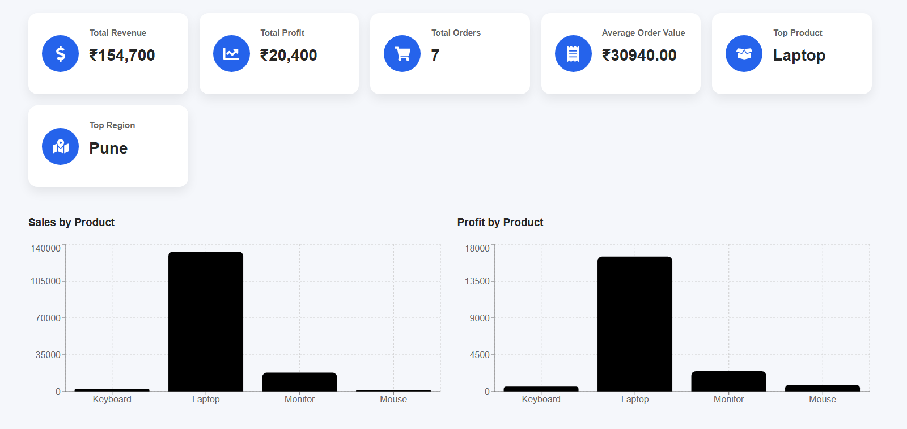

# 📊 InsightAI

### AI Powered Business Intelligence Platform

InsightAI is an AI-powered Business Intelligence Platform that enables users to upload business datasets (CSV/Excel), automatically analyze them, generate interactive dashboards, and provide meaningful business insights. The project is built using React, Material UI, FastAPI, and Python.

---

## 🚀 Features

- 📁 Upload CSV and Excel datasets
- 📈 Interactive dashboard with KPIs
- 📊 Sales & Profit visualizations
- 📍 Region-wise business analysis
- 🏆 Top Product & Top Region detection
- 🧹 Data Cleaning API
- 📋 Dataset Profiling
- 📑 Business Insights Generation
- 🎨 Modern Material UI Dashboard

---

## 🛠️ Tech Stack

### Frontend

- React.js
- Material UI (MUI)
- Axios
- Recharts

### Backend

- FastAPI
- Python
- Pandas
- NumPy
- Uvicorn

### Tools

- Git
- GitHub
- VS Code

---

## 📂 Project Structure

```
InsightAI
│
├── backend
│   ├── app
│   │   ├── services
│   │   ├── utils
│   │   └── main.py
│   └── requirements.txt
│
├── frontend
│   ├── src
│   │   ├── components
│   │   ├── pages
│   │   ├── services
│   │   └── theme
│   └── package.json
│
├── datasets
├── README.md
└── .gitignore
```

---

## 📸 Dashboard

> Add screenshots inside a folder named `screenshots/`

### Dashboard



---

## ⚙️ Installation

### Backend

```bash
cd backend

python -m venv venv

venv\Scripts\activate

pip install -r requirements.txt

uvicorn app.main:app --reload
```

Backend runs on:

```
http://127.0.0.1:8000
```

---

### Frontend

```bash
cd frontend

npm install

npm run dev
```

Frontend runs on:

```
http://localhost:5173
```

---

## 📊 Current Features

- Upload CSV
- Upload Excel
- Dashboard Generation
- KPI Cards
- Interactive Charts
- Business Insights
- Dataset Profiling
- Data Cleaning

---

## 🚧 Upcoming Features

- 🤖 Gemma 3 AI Integration
- 💬 Natural Language Business Queries
- 📄 PDF Report Generation
- 📈 Advanced Analytics
- 📊 Multiple Dataset Comparison
- 👤 User Authentication
- ☁️ Cloud Deployment

---

## 🎯 Example Workflow

```
Upload Dataset

        ↓

Backend Analysis

        ↓

Data Cleaning

        ↓

Dashboard Generation

        ↓

Business Insights

        ↓

AI Recommendations (Upcoming)
```

---

## 👨‍💻 Author

**Vedang Pewekar**

Final Year B.Tech Project

Computer Science & Business Systems

---

## 📄 License

This project is developed for educational and learning purposes.